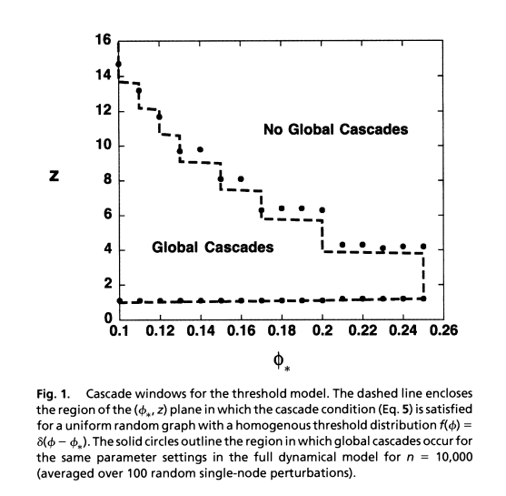
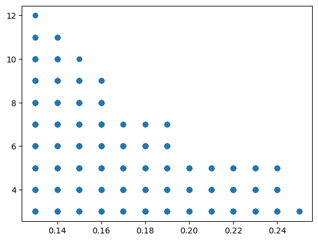

## Replikation of Watts paper
## Intro
One of my professor told us we should try to recread already existing papers to lern. She told us she had done this with a paper from Watts and I thougt I schould try this also. This is a short description of the paper and what and how I recreated.
## Watts paper
Duncan J. Watts wrote in 2001 a paper about cascades in social Networks. A cascade occurred when alot of people adapt something because they were influenced by their social contacts. To study this he made a simplified simulation of the situation, for which he generated random networks in which every node had a fixed probability of adapting a behavior. If the relative number of occurrence of the behavior from the neighbors of a single node surpasses its probability, the node will adapt this behavior.
## What I want to replicate 
For this paper he tested the prerequisite for which a small change can have a big influence on the network. This he showed in Figure 1

here he plots every time a cascade had occurred, dependent on the mean number of connections (z) and the likelihood of adopting. This he tested in a Network of 10.000 Nodes.
## What I did 
I wanted to recreate this figure without using the networkx library. Thats why I defined my own network class with important functions to recreate the figure. I created functions to generate the network, to change the color of a few random ones and a function to check how many other nodes wold then also change their color.
Because the simulation of the network is very rescue heavy I had to limit the network size to 5.000, I started the cascade with a shock of 30 nodes. Because of the long runtime I also wanted to run the computation on a server, to more easily do this I outsourced the main code to for_server.py.
### The replication
After running the simulation I plotted the data in the same way Watts did.
  
While the plots are not identical you definitely can see the same trends. In both plots, you can identify the staircase with growing step sizes.
## Conclusion and Outlook
While not the same the plots for me are close enough to conclude the replication to be a success. To improve the similarity, I could try running code on better hardware or optimize the code to simulate a 10.000 node network. A other option could be to add multiple colors which the nodes can have, or not just have a minimal probability but also a maximal one.
